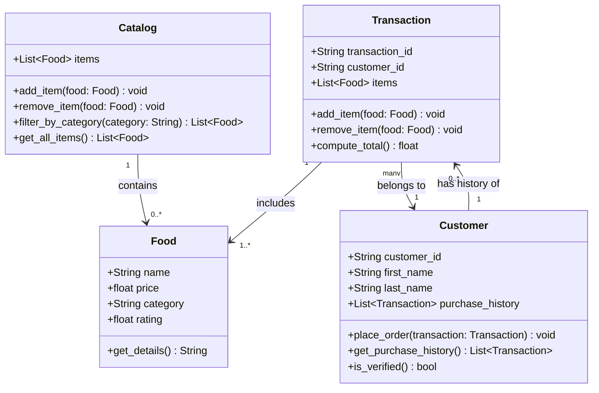

# ByteBites UML Class Diagram



## User Flow

```
1. Customer browses Catalog
   └── Catalog.filter_by_category() or get_all_items()

2. Customer selects Food items
   └── Transaction.add_item() for each selection

3. Customer reviews order
   └── Transaction.compute_total()

4. Customer places order
   └── Customer.place_order(transaction)
   └── Transaction appended to Customer.purchase_history

5. System verifies customer
   └── Customer.is_verified() checks purchase_history is non-empty
```
